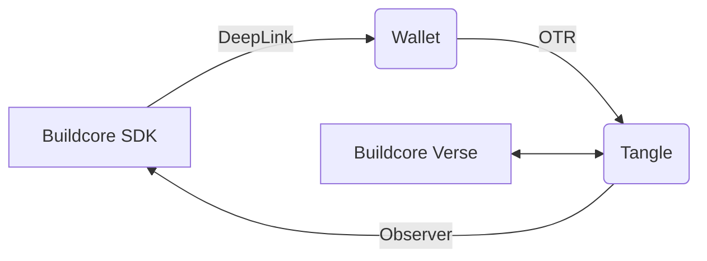
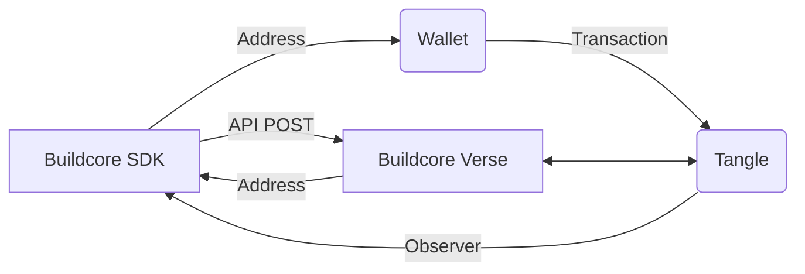

import { Buildcore, SoonaverseApiKey } from '@site/../packages/sdk/src/https';
import TabItem from '@theme/TabItem';
import Tabs from '@theme/Tabs';

Buildcore API provides various ways to interact with our platform. The recommended one is the [@buildcore/sdk](https://www.npmjs.com/package/@buildcore/sdk) which interacts through a REST API and our so called [OTRs](#otr) with the Buildcore platform.

## SDK

Just add the SDK to your project and get startet:

```bash npm2yarn
npm i @buildcore/sdk
npm i @buildcore/interfaces
```

The sdk is split into two modules to interact with the Buildcore platform. `otr` and `https`. Checkout the following sections to lern more.

:::info

To create Requests we recommend using the OTR method instead of POST requests and only use the https module to monitor the Tangle or create get information from the backend.

:::

## OTR

On tangle requests are a secure and transparent way to interact with Buildcore products. They are a way to send a request to a Buildcore backend over the Tangle as a transaction.
The backend will then execute the request encoded in the OTR. All interactions can be verified on the Tangle.



As you see in the chart above, the workflow of working with OTR is the following:

1. Prepare the OTR data with the SDK and create a Deeplink for the request.
2. Clicking the Deeplink in for example a dApp frontend will open the specific wallet with a preconfigured transaction to create the OTR. The OTR is a transaction on the Tangle to a specific OTR Address with encoded metadata.
3. The Buildcore Backend (a so called `Verse`) will monitor the tangle and check if OTRs where send to its (OTR-)Address. If so the request will be handled and if necessary assets or a response will be send back to the caller/wallet via Tangle.
4. The SDK can monitor the transaction with an [Observable](./reference-api/classes/Observable.md) object and check its status.

### Example

To use OTR with the SDK you need to choose an OTR Address and create an [otrWrapper](./reference-api/classes/OtrWrapper.md) object. Checkout this small example:

```tsx file=../../packages/sdk/examples/basic_otr.ts

```

:::info Development Environment

You can specify the environment you want to work in, by using the specific OTR Address. In the SDK you can use the [SoonaverseOtrAddress enum](./reference-api/enums/SoonaverseOtrAddress.md) to get the correct address.

:::

## HTTPS

The SDK also provides a wrapper for Buildcores API.

:::info

We are in the process of migrating POST requests to OTR.

:::



As you see in the chart above, the workflow of working with HTTPS POST is the following:

1. The SDK creates a POST request. This request has to be signed by either a web3 wallet like Metamask or Tanglepay. The response will contain specific Address for this request from the Buildcore backend (so called verse).
2. This Address can than be used by a wallet to send the needed funds/assets for the request.
3. The Buildcore Verse will monitor the tangle and check if funds/assets where send to the Address. If so the request will be handled and if necessary assets or a response will be send back to the caller via Tangle.
4. The SDK can monitor the transaction with an Observer and check its status.

### Example

To interact with the API you need to choose an endpoint you want to connect to and create an `httpsWrapper` object.
Let's do a simple GET Request to get the member's object of `Santa Claus`:

```tsx file=../../packages/sdk/examples/basic_https.ts

```

### API Endpoints and Keys

We provide two endpoints. One for testing and one for production. In the SDK you can access them with the [Buildcore enum](./reference-api/enums/Buildcore.md). You can also find them here:

<Tabs groupId="environment">
  <TabItem value="production" label="Production Endpoint">
    <pre>
      <code>{Buildcore.PROD}</code>
    </pre>
  </TabItem>
  <TabItem value="testing" label="Testing Endpoint">
    <pre>
      <code>{Buildcore.TEST}</code>
    </pre>
  </TabItem>
</Tabs>

> Make sure to consider [API's limitations](#limitations)

:::info API Keys

To work with the API you need access keys which you can get by [creating a project](./how-to/project/create-project.mdx).
You can also use public Soonaverse keys to test against live community driven project. In the SDK you can access the following Keys through the [SoonaverseApiKey constant](./reference-api/modules#soonaverseapikey).

:::

<Tabs groupId="environment">
  <TabItem value="production" label="Production Key">
    <pre>
      <code>{SoonaverseApiKey[Buildcore.PROD]}</code>
    </pre>
  </TabItem>
  <TabItem value="testing" label="Testing Key">
    <pre>
      <code>{SoonaverseApiKey[Buildcore.TEST]}</code>
    </pre>
  </TabItem>
</Tabs>

## Limitations

We only allow:

- unlimited number of requests on OTR through Tangle - recommended!
- maximum of 50 requests per second on GET requests
- maximum of 5 requests per second on POST requests

If you need higher throughput make sure to reach out to use so we can enable higher throughput for you.

This limits are necessary to avoid abuse and dDos attacks.

## See some of our first how to's:

- [Create Project](how-to/project/create-project)
- [Create Space](how-to/dao-management/space/create-space)
- [Create Member](how-to/dao-management/member/create-member)
- [Update Member](how-to/dao-management/member/update-member)
- [Create NFT Collection](how-to/nft/create-collection)
- [Create Stamp](how-to/stamp/create-stamp)
